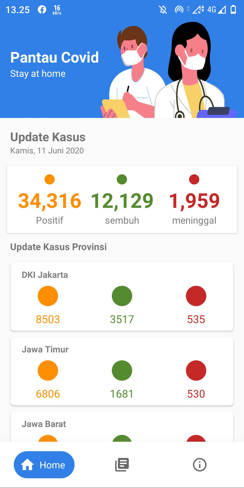
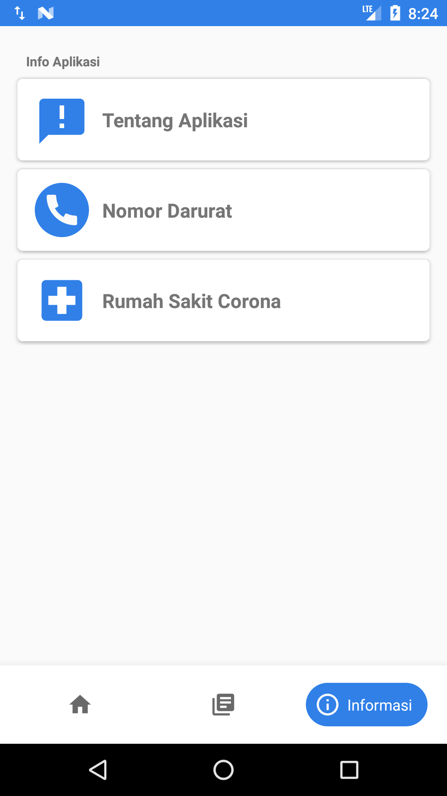
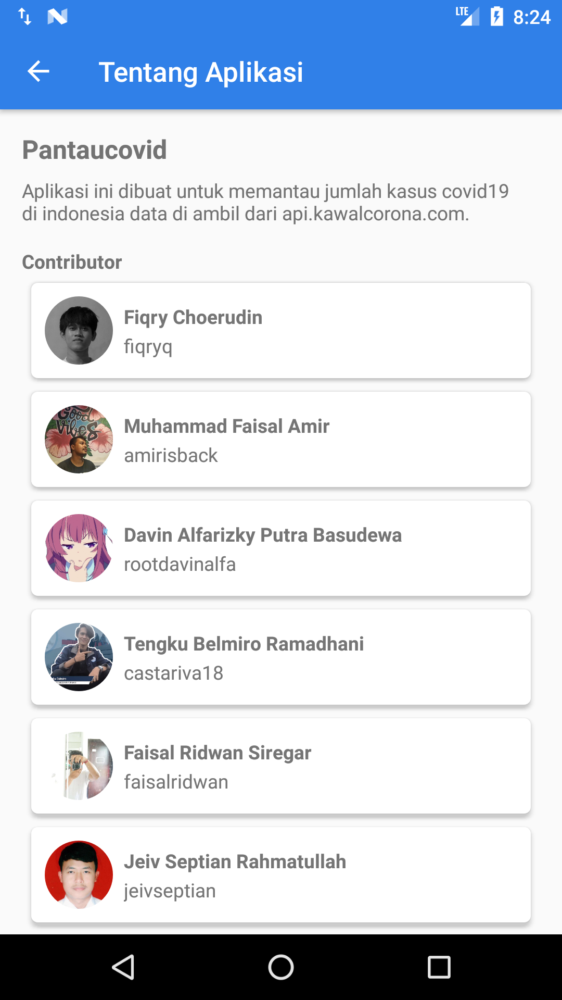

# Pantaucovid

Information about Covid 19.

## Screenshoot Apps (Development-Mode)

## Doing task
- Find TODO list on issue
- Pickup Task with label "all ready pickup"

## Tech 👨‍💻
- [Retrofit](https://square.github.io/retrofit/) - Retrofit
- [hdodenhof](https://github.com/hdodenhof/CircleImageView) - hdodenhof
- [okHttp](https://square.github.io/okhttp/) - okHttp
- [frogo recycler view](https://github.com/amirisback/frogo-recycler-view) - frogo recycler view
- [Rx Java](https://github.com/ReactiveX/RxJava) - Rx Java

## Completed task
- [x] Change the label already pick up to be ready to review
- [x] Waiting Pull owner for merge request
- [x] Finish

## Colaborator
Very open to anyone, I'll write your name under this, please contribute by sending an email to me

- Mail To fiqrychoerudin48@gmail.com
- Subject : Github _ [Github-Username-Account] _ [Language] _ [Repository-Name]
- Example : Github_fiqryq_java_Pantau-Covid19

## Contributors

<!-- ALL-CONTRIBUTORS-LIST:START - Do not remove or modify this section -->
<!-- prettier-ignore-start -->
<!-- markdownlint-disable -->

<table>
    <tr>
    <td align="center"><a href="https://github.com/fiqryq"> <b>Fiqry Choerudin</b></td>
    <td align="center"><a href="https://github.com/amirisback"> <b>Muhammad Faisal Amir</b></td>
    <td align="center"><a href="https://github.com/rootdavinalfa"> <b>Davin Alfarizky Putra Basudewa</b></td>
    <td align="center"><a href="https://github.com/castariva18"> <b>Tengku Belmiro</b></td>
    <td align="center"><a href="https://github.com/jeivseptian"> <b>Jeiv Septian</b></td>
    </tr>
</table>

<!-- markdownlint-enable -->
<!-- prettier-ignore-end -->
<!-- ALL-CONTRIBUTORS-LIST:END -->

Waiting for your contribute

## Attention !!!
Please enjoy and don't forget fork and give a star
- Don't Forget Follow My Github Account
- If you like this library, please help me / you can donate to buy patreon services

